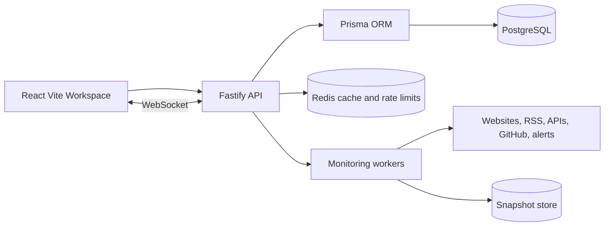

# Architecture

## Frontend

The frontend uses route-level product surfaces with persisted Zustand state for workspace preferences, command history, trackers, alert toggles, and panel layouts.

## Backend

Fastify handles validated REST endpoints, WebSocket events, secure headers, CSRF, rate limits, compression, and auth helpers.

## Database

Prisma models preserve relational ownership and indexed access paths for users, boards, trackers, snapshots, alerts, notifications, audit logs, and analytics rollups.

## Scaling path

- Move monitoring execution into worker queues
- Store snapshot artifacts in object storage
- Use Redis streams for event fan-out
- Add tenant-scoped row access policies
- Promote analytics rollups into scheduled jobs
